I'll create a comprehensive **User Journey Automation System** that guides customers from first contact to becoming loyal advocates. Let me design this as a complete automated flow:

## 🚀 User Journey Automation System

### **Stage 1: AWARENESS** 🔍

*First Touch → Interest*

```yaml
Trigger_Points:
  - Website_Visit:
      action: "Deploy exit-intent popup"
      offering: "Free PRD Template Guide"
      language: "Auto-detect (Arabic/English)"

  - Social_Media_Engagement:
      platforms: ["LinkedIn", "Twitter", "Instagram"]
      action: "Retargeting pixel activation"
      followup: "Send DM with resource link"

  - Content_Discovery:
      blog_posts: "Track reading time > 30 seconds"
      action: "Show contextual CTA"
      personalization: "Based on content topic"

Automation_Flow:
  1. Capture_Lead:
     - Email/Phone collection
     - WhatsApp opt-in (Saudi preference)
     - Tag with source & interest

  2. Instant_Welcome:
     - Send welcome message (< 5 minutes)
     - Deliver lead magnet
     - Schedule follow-up sequence

  3. Nurture_Sequence:
     Day_0: "Welcome + Quick Win Tip"
     Day_2: "Success Story (Saudi Entrepreneur)"
     Day_4: "Free Tool Demo Video"
     Day_7: "Limited Time Trial Offer"
```

### **Stage 2: CONSIDERATION** 🤔

*Interest → Evaluation*

```javascript
// Personalized Demo Automation
const considerationAutomation = {
  behavioral_triggers: {
    pricing_page_visit: {
      action: "Show comparison calculator",
      followup: "Send ROI analysis email"
    },

    feature_exploration: {
      track: ["time_on_page", "clicks", "scroll_depth"],
      threshold: "high_engagement",
      action: "Offer personalized demo"
    },

    competitor_comparison: {
      detect: "comparison_keywords",
      action: "Highlight unique features",
      message: "Why we're different"
    }
  },

  automated_responses: {
    chatbot: {
      greeting: "مرحباً! كيف يمكنني مساعدتك؟ | Hi! How can I help?",
      qualification: ["budget", "timeline", "use_case"],
      routing: "qualified_to_sales"
    }
  }
}
```

### **Stage 3: DECISION** 💡

*Evaluation → Purchase*

```yaml
Decision_Automation:
  Trial_Activation:
    immediate_actions:
      - Create_workspace
      - Send_getting_started_video
      - Assign_onboarding_specialist
      - Schedule_check_in_call

  Usage_Monitoring:
    Day_1:
      low_activity: "Send tutorial email"
      medium_activity: "Share advanced tips"
      high_activity: "Offer extended trial"

    Day_3:
      milestone_check: "First PRD created?"
      yes: "Celebrate + next steps"
      no: "1-on-1 assistance offer"

    Day_7:
      conversion_prediction:
        high_probability: "Special discount"
        medium_probability: "Case study + testimonials"
        low_probability: "Free consultation"

  Objection_Handling:
    price_concern:
      - Show ROI calculator
      - Offer payment plan
      - Highlight time savings

    feature_questions:
      - Instant Claude AI response
      - Schedule demo
      - Send comparison chart
```

### **Stage 4: ONBOARDING** 🎯

*Purchase → First Success*

```javascript
// Smart Onboarding Automation
const onboardingJourney = {
  welcome_sequence: {
    minute_0: {
      actions: [
        "Send invoice/receipt",
        "Account activation email",
        "WhatsApp confirmation"
      ]
    },

    hour_1: {
      actions: [
        "Welcome video from CEO",
        "Quick start guide",
        "Calendar booking link"
      ]
    },

    day_1: {
      morning: "First task assignment",
      afternoon: "Check progress",
      evening: "Tips for tomorrow"
    }
  },

  progressive_disclosure: {
    week_1: "Core features only",
    week_2: "Intermediate features",
    week_3: "Advanced features",
    week_4: "Power user features"
  },

  success_milestones: {
    first_prd: "🎉 Celebration message + badge",
    first_prototype: "🚀 Share achievement",
    first_week: "📊 Progress report",
    first_month: "🏆 Success certificate"
  }
}
```

### **Stage 5: ADOPTION** 📈

*First Success → Regular Usage*

```yaml
Adoption_Automation:
  Usage_Analytics:
    daily_tracking:
      - Login frequency
      - Feature usage
      - Time in platform
      - Output quality

    engagement_scoring:
      low: "Re-engagement campaign"
      medium: "Feature discovery"
      high: "Advanced training"

  Personalized_Recommendations:
    based_on:
      - Industry vertical
      - Company size
      - Usage patterns
      - Success metrics

    deliver_via:
      - In-app notifications
      - Weekly digest email
      - WhatsApp tips
      - Video tutorials

  Community_Building:
    auto_invite:
      - Slack community
      - Weekly webinars
      - User forums
      - Success stories
```

### **Stage 6: RETENTION** 🔄

*Regular Usage → Loyalty*

```javascript
// Retention & Churn Prevention
const retentionAutomation = {
  health_scoring: {
    indicators: {
      positive: ["daily_login", "feature_adoption", "output_creation"],
      negative: ["decreased_usage", "support_tickets", "failed_payments"]
    },

    risk_levels: {
      healthy: {
        action: "Reward loyalty",
        automation: "Send exclusive content"
      },
      at_risk: {
        action: "Proactive outreach",
        automation: "Personal check-in call"
      },
      critical: {
        action: "Escalate to success team",
        automation: "Retention offer"
      }
    }
  },

  renewal_automation: {
    day_minus_30: "Usage report + value reminder",
    day_minus_14: "Renewal discount offer",
    day_minus_7: "Personal outreach",
    day_minus_1: "Final reminder + incentive"
  }
}
```

### **Stage 7: EXPANSION** 📊

*Loyalty → Growth*

```yaml
Expansion_Automation:
  Upsell_Triggers:
    usage_limits:
      80_percent: "Suggest upgrade"
      95_percent: "Urgent upgrade"
      100_percent: "Auto-upgrade offer"

    feature_requests:
      enterprise_feature: "Schedule enterprise demo"
      team_collaboration: "Team plan introduction"
      api_access: "Developer plan pitch"

  Cross_Sell_Opportunities:
    complementary_tools:
      - "PRD Creator → Prototype Tool"
      - "Single Tool → Complete Suite"
      - "Basic → Enterprise"

    timing:
      - Post successful milestone
      - Quarterly business review
      - New feature launch
```

### **Stage 8: ADVOCACY** 🌟

*Growth → Ambassador*

```javascript
// Advocacy & Referral Automation
const advocacyAutomation = {
  nps_automation: {
    trigger: "quarterly_or_milestone",

    responses: {
      promoter: {
        score: "9-10",
        action: "Request testimonial + referral",
        reward: "Exclusive benefits"
      },
      passive: {
        score: "7-8",
        action: "Gather feedback",
        followup: "Improvement communication"
      },
      detractor: {
        score: "0-6",
        action: "Immediate intervention",
        escalation: "Senior team member"
      }
    }
  },

  referral_program: {
    automatic_tracking: "Unique referral codes",
    instant_rewards: "Both parties benefit",
    gamification: "Leaderboard + badges",
    social_sharing: "One-click sharing"
  }
}
```

---

## 🎯 Complete Journey Map Visualization

```mermaid
graph LR
    A[🔍 Awareness] -->|Lead Capture| B[🤔 Consideration]
    B -->|Trial/Demo| C[💡 Decision]
    C -->|Purchase| D[🎯 Onboarding]
    D -->|Activation| E[📈 Adoption]
    E -->|Engagement| F[🔄 Retention]
    F -->|Satisfaction| G[📊 Expansion]
    G -->|Success| H[🌟 Advocacy]
    H -->|Referrals| A

    style A fill:#ff6b6b
    style B fill:#4ecdc4
    style C fill:#45b7d1
    style D fill:#96ceb4
    style E fill:#feca57
    style F fill:#48dbfb
    style G fill:#ff9ff3
    style H fill:#54a0ff
```



---

## 🤖 Automation Tools Configuration

### **Zapier Workflow Example:**

```javascript
// Multi-Step User Journey Zap
{
  trigger: "New Lead from Website",

  actions: [
    {
      app: "HubSpot",
      action: "Create/Update Contact",
      data: {
        email: "{{trigger.email}}",
        lifecycle_stage: "lead",
        language: "{{trigger.language}}",
        source: "website"
      }
    },
    {
      app: "Claude AI",
      action: "Generate Personalized Message",
      prompt: "Create welcome message for Saudi entrepreneur interested in {{trigger.interest}}"
    },
    {
      app: "WhatsApp Business",
      action: "Send Message",
      template: "welcome_journey_arabic"
    },
    {
      app: "Calendly",
      action: "Create Booking Link",
      for: "personalized_demo"
    },
    {
      app: "Google Sheets",
      action: "Add Row",
      track: "journey_metrics"
    }
  ]
}
```

### **N8N Workflow for Complex Logic:**

```javascript
// Behavioral Trigger Automation
const n8nWorkflow = {
  nodes: [
    {
      type: "webhook",
      name: "User Activity Trigger",
      endpoint: "/user-activity"
    },
    {
      type: "function",
      name: "Calculate Engagement Score",
      code: `
        const score = calculateEngagement(items[0].json);
        return [{json: {score, tier: getTier(score)}}];
      `
    },
    {
      type: "switch",
      name: "Route by Engagement",
      rules: [
        {condition: "score > 80", output: "high_engagement_path"},
        {condition: "score > 50", output: "medium_engagement_path"},
        {condition: "score <= 50", output: "low_engagement_path"}
      ]
    },
    {
      type: "claude",
      name: "Generate Personalized Content",
      prompt: "Based on {{engagement_tier}}, create next best action"
    }
  ]
}
```

---

## 📊 Success Metrics & KPIs

| Journey Stage | Key Metrics | Automation Goal | Target |
|--------------|-------------|-----------------|---------|
| Awareness | Lead Capture Rate | Auto-qualify leads | 25% |
| Consideration | Demo Booking Rate | Schedule automatically | 40% |
| Decision | Trial-to-Paid | Smart nudges | 30% |
| Onboarding | Time to First Value | Guided setup | <24h |
| Adoption | Feature Adoption | Progressive disclosure | 70% |
| Retention | Monthly Churn | Predictive intervention | <5% |
| Expansion | Upsell Rate | Timely offers | 20% |
| Advocacy | NPS Score | Automated surveys | >50 |

This complete user journey automation system ensures no customer falls through the cracks while maintaining a personalized, culturally-aware experience for your Saudi Arabian market.

Would you like me to detail any specific stage further or create implementation code for any particular automation?
